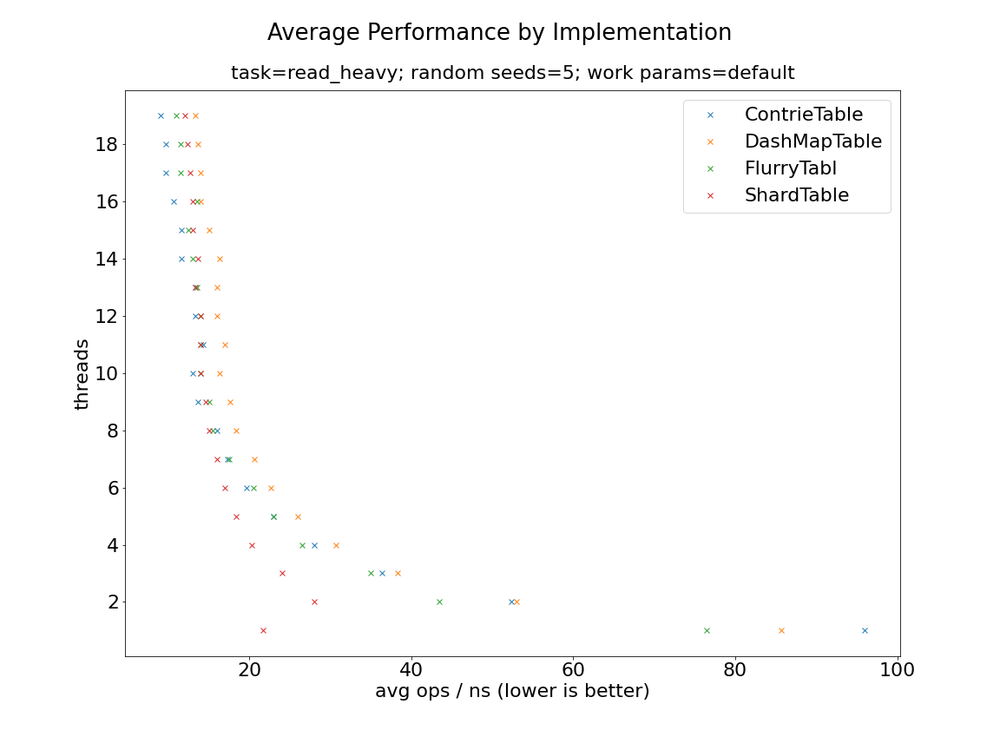
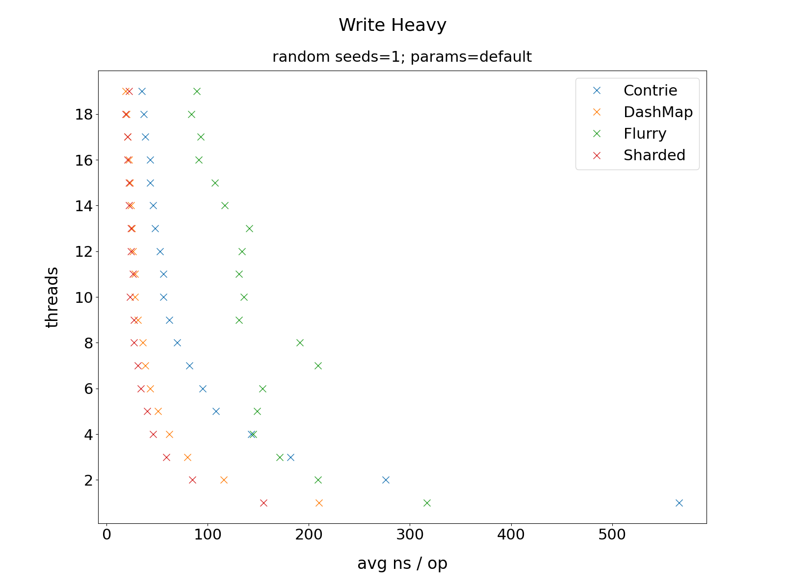
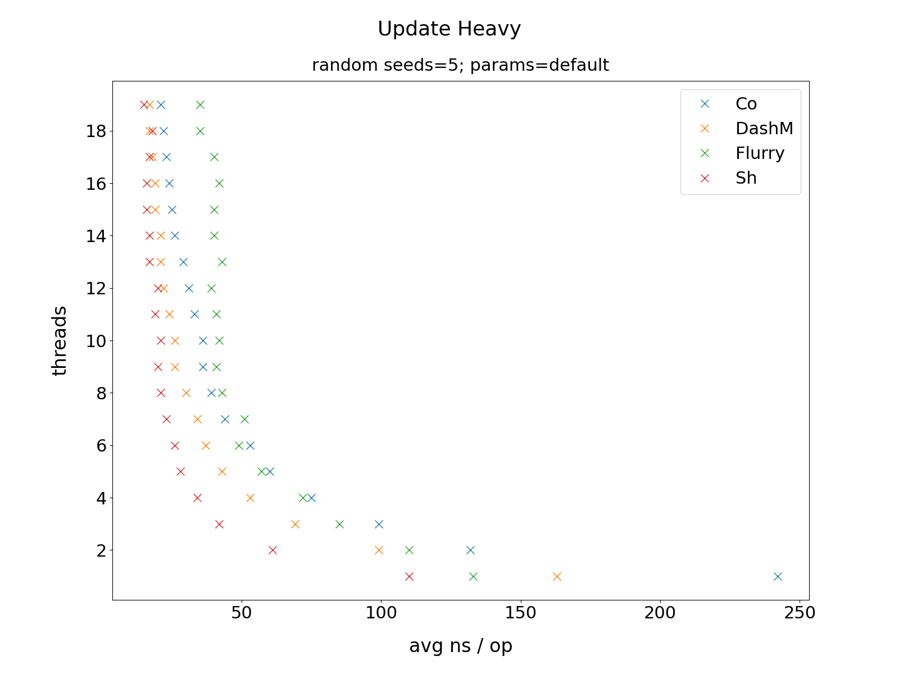
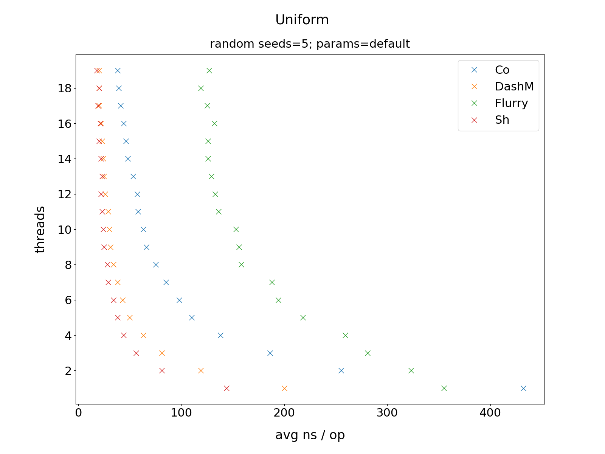

### Average Performance by Implementation

This ran each implementation over the presets in [`bustle::Mix`](https://docs.rs/bustle/0.4.1/bustle/struct.Mix.html) for 5 
iterations/random seeds. Lower numbers are better. Approaches using a single `std::sync` Lock and `chashmap` were discarded for clarity (they are
a lot slower). If you know why `chashmap` is so slow in this test, please help here.

